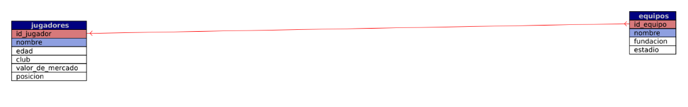

# Leandro-Marcos---Simon-Marconi-TP-WEB

La idea del trabajo era formar dos tablas, una de jugadores y una de equipos con subjetivamente los mejores jugadores del BIG SIX (los 6 grandes) de la liga inglesa, la Premier League o EPL.
La idea de jugadores y equipos es un buen ejemplo de relacion 1 a N, ya que un equipo puede tener multiples jugadores, pero estos jugadores pertenecen a un solo equipo. Por ejemplo, el Manchester United puede tener muchisimos jugadores, pero si vamos al caso contreto de Lisandro Martinez, solamente forma parte de este equipo.
La relacion justamente se da en esto, los mejores jugadores del BIG SIX y a los equipos que pertenecen
