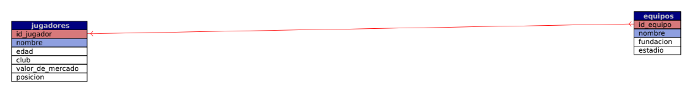

# Leandro-Marcos---Simon-Marconi-TP-WEB

La idea del trabajo era formar dos tablas, una de jugadores y una de equipos con subjetivamente los mejores jugadores del BIG SIX (los 6 grandes) de la liga inglesa, la Premier League o EPL.
La idea de jugadores y equipos es un buen ejemplo de relacion 1 a N, ya que un equipo puede tener multiples jugadores, pero estos jugadores pertenecen a un solo equipo. Por ejemplo, el Manchester United puede tener muchisimos jugadores, pero si vamos al caso contreto de Lisandro Martinez, solamente forma parte de este equipo.
La relacion justamente se da en esto, los mejores jugadores del BIG SIX y a los equipos que pertenecen

PARTE 2
¿Cómo usar la página? Primero hay que tener instalado el servidor local XAMPP. Una vez instalado, se guarda esta carpeta, con todos sus archivos dentro en donde hayas instalado xampp. Es decir, si lo instalaste en Windows(C:), la guardas ahi, dentro de la carpeta llamada "xampp" y luego en la carpeta "htdocs". De ese modo, la página ya podría funcionar, pero para eso, deberías prender Xampp e ir a "Apache" y "MySQL" y apretar en ambos "start".
Una vez apretados estos dos botones, se habilitan los botones "Admin", si apretas en ese botón en "Apache", te lleva a localhost/dashboard, la pagina de presentacion de Xampp. Se borra dashboard y se pone el nombre de la carpeta, quedando localhost/Leandro-Marcos---Simon-Marconi-TP-WEB
Eso te lleva directamente al home de la pagina y ya podes usarla normalmente!
